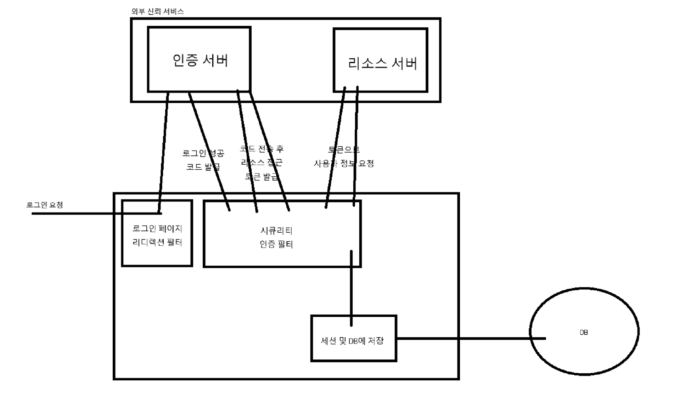

# spring-security-oauth2-client-session

- Spring Security OAuth2 Client Session 방식 구현 개념 학습 및 실습 코드 업로드용 리포지토리
- 구현 시 특징
  - 인증 : 네이버 소셜 로그인, 구글 소셜 로그인 (코드 방식)
  - 인가 : 세션 방식을 통한 경로별 접근 권한
  - 인증 정보는 DB 저장 후 추가 정보 기입
  - OAuth2.0 코드 인증 방식을 활용함
  - 인증 후 발급된 정보로 세션을 만들고 SSR 방식으로 모든 페이지를 응답
  - 소셜 로그인을 통해 인증 받은 데이터는 서비스 데이터베이스에 저장을 한 뒤 관리를 진행함
- 동작 원리
  - 출처 : [https://www.devyummi.com/page?id=668e8feb5eb1ff86c03b7103](https://www.devyummi.com/page?id=668e8feb5eb1ff86c03b7103)
    
- 참고 자료
  - YOUTUBE : [개발자 유미](https://www.youtube.com/playlist?list=PLJkjrxxiBSFBGk0b931ZkCVlNUo7sFisu)
  - Site : [개발자 유미](https://www.devyummi.com/page?id=668e8bff9601715cc45a971f)
  - Docs : [spring.io > Spring Security Docs](https://docs.spring.io/spring-security/reference/index.html)
